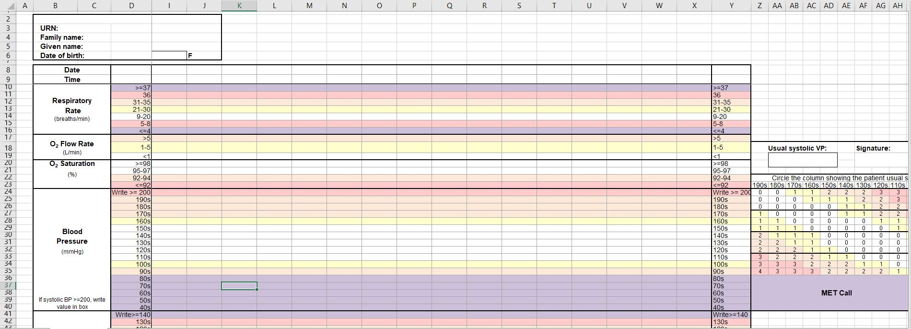

# 5 Vitals Visualization
> Program used to report patient data using pandas in Python 

## Table of contents
* [General info](#general-info)
* [Modules](#modules)
* [Screenshots](#screenshots)
* [Technologies](#technologies)
* [Status](#status)
* [License](#license)

## General info
This program uses pandas and xlsxwriter in order to parse excel files in .xlsx
and csv and renders report of patient 5 vitals, GCS, and prescription information.
The files can be read individually or in batches based on subject data; the Sorter.py
file runs the patient data individually, while the iSorter.py file runs the patient
data in batches based on the file name provided. 

There are a total of 46520 patient ChartEvents files provided along with matching
prescription files that give information on the route and type of prescription
the subject is taking. All subjects have a registered subject_id. These are available
from the <a href="https://mimic.physionet.org/">MIMIC-II</a> database generously provided
by physionet.

The project requires us to separate the patients batches by the 5 vitals: Heart Rate,
Blood Pressure, Temperature, Respiratory Rate, and O2 Saturation. The item ids that
are used to parse these data are listed below.

HEART RATE
- 220045, 211

BLOOD PRESSURE
- 220179, 455 -- "Systolic Blood Pressure"
- 220180, 8441 -- "Diastolic Blood Pressure"

TEMPERATURE
- 223762, 676 -- "Temperature Celsius"
- 223761, 678 -- "Temperature Fahrenheit"

RESPIRATORY RATE
- 220210, 618

O2 Saturation
- 220277, 646

The data are then sorted to form a dataframe with each of the vital's itemid and their 
corresponding chart time, and then merged into the visualization table which will be 
printed to the 'Visualization' sheet on the report. The data is then taken from the
Visualization sheet and charted under a new 'Report' sheet. In the report sheet, the
prescription and GCS table values are also listed.

The completed batch files will be stored in folders of their ICD9 disease values, which
are listed below. The subjects which match these values can be found in the folders
above.

ICD9 disease values:
- <b>460-466</b>  Acute Respiratory Infections
- <b>470-478</b>  Other Diseases Of Upper Respiratory Tract
- <b>480-488</b>  Pneumonia And Influenza
- <b>490-496</b>  Chronic Obstructive Pulmonary Disease And Allied Conditions
- <b>500-508</b>  Pneumoconioses And Other Lung Diseases Due To External Agents
- <b>510-519</b>  Other Diseases Of Respiratory System
- <b>E8859</b>    Accidental fall on same level from slipping tripping or stumbling

## Modules
The python files can be found under the folder Python_Files, with the main files being
Sorter.py and iSorter.py.

<b>Sorter.py</b> is a file for parsing an individual patient file while <b>iSorter.py</b>
parses multiple patient files in batches.

## Screenshots

## Technologies
* Python 2.7 or 3.6

## Status
Project is: _Completed_

All remaining issues have been resolved. Possible implementation of a dashboard or 
analysis algorithm is in progress.

## License
